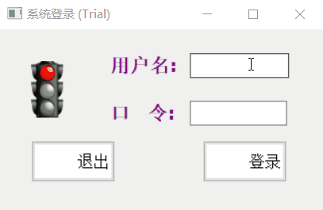
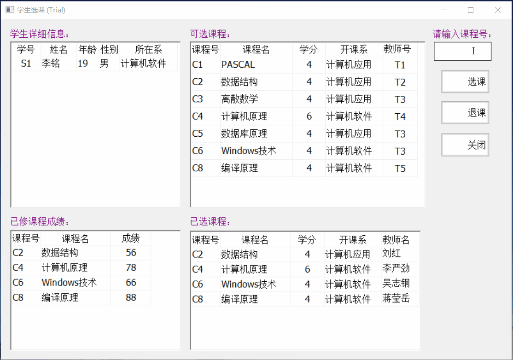
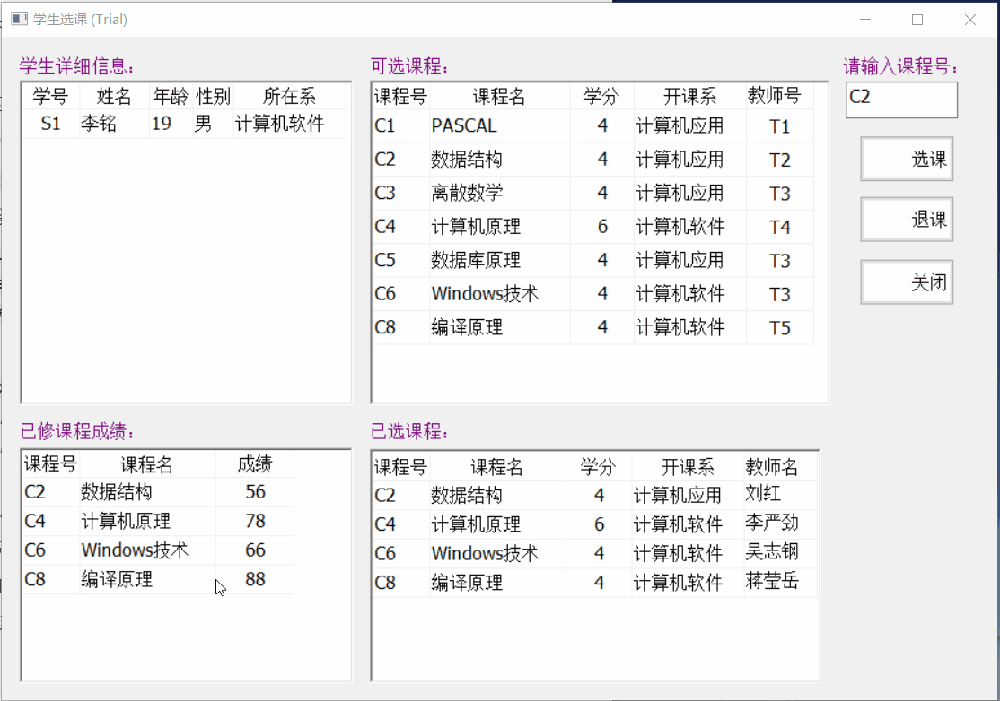
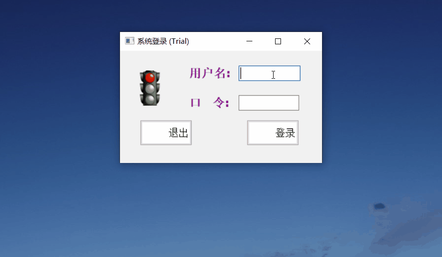
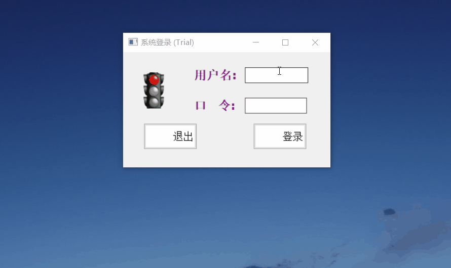
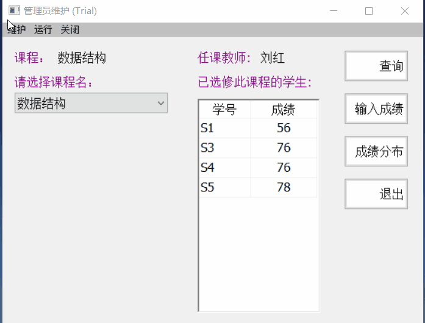
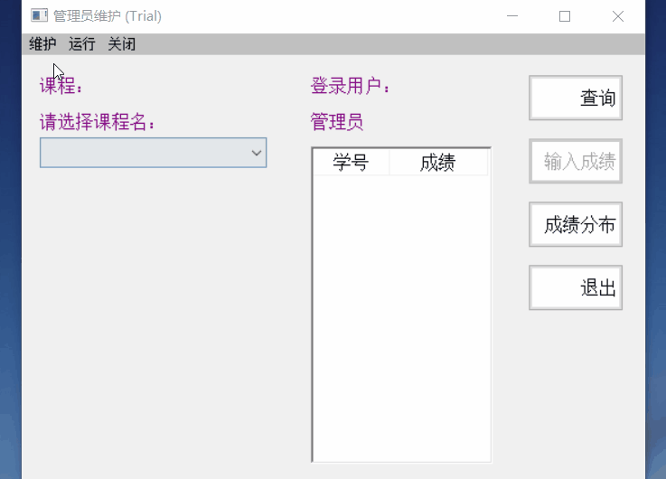
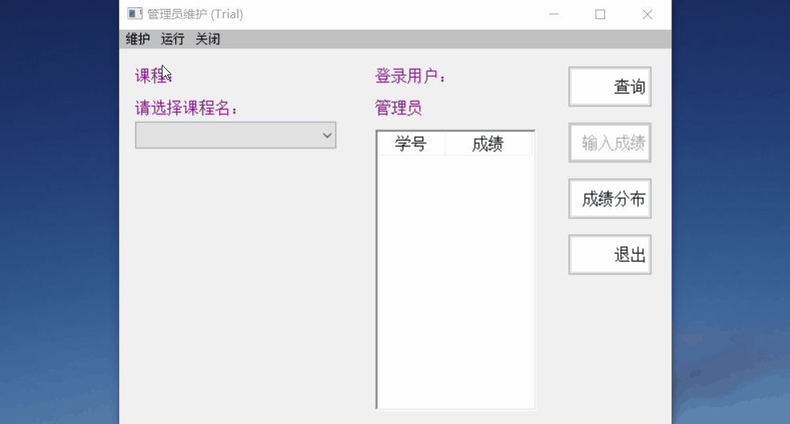
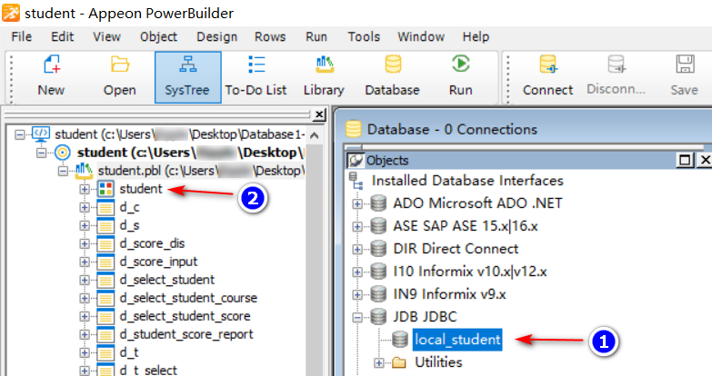

# "学生选课成绩管理系统" 示例程序验证

> 实验项目基于`数据库实用教程/董健全，丁宝康编著. ——4版. ——北京：清华大学出版社`
>
> 

## 一、目的与要求

1. 通过示例程序的验证，学习开发管理系统的基本方法。
2. 阅读、理解并按照 "学生选课成绩管理系统" 的开发工程中介绍的内容和本实验要求进行实际操作。
3. 学习和掌握 PowerBuilder 开发环境提供的工具建立应用程序的步骤和方法。
4. 学习和初步掌握应用 PowerBuilder 提供的调试测序 (Debug) 进行应用程序的调试。

## 二、实验步骤

按照 "学生选课成绩管理系统" 的开发过程中介绍的内容进行如下操作：

1. 在 D 盘 Student 目录下创建工作空间和目标 Student。

2. 建立应用 (Application) 对象 Student。

3. 连接 "实验一" 所建立的 SQL 数据库 student。

4. 在应用中创建 9 个数据窗口 (DataWindow)，其中包含四个不带参数的数据窗口：

   ​	`教师表(d_t)`，

   ​	`学生表(d_s)`，

   ​	`课程表 (d_c)`，

   ​	`成绩分布情况(d_score_dis)`；

   另外还有五个带参数的数据窗口：

   ​	`成绩输入-带参数cnum(d_score_input)`，

   ​	`学生成绩报告单(d_student_score_report)`，

   ​	`学生详细信息-带参数snum(d_select_student)`，

   ​	`学生成绩-带参数snum(d_select_student_score)`，

   ​	`学生选课情况-带参数snum(d_select_student_course)`。

5. 在应用中创建 9 个窗口 (Window)，其中包括：

   ​	`系统登录(w_login)`，

   ​	`管理员维护(w_manage)`，

   ​	`课程表(w_create_course)`，

   ​	`学生表(w_create_student)`，

   ​	`教师表(w_create_teacher)`，

   ​	`学生选课(w_select_course)`，

   ​	`成绩管理(w_teacher_manage)`，

   ​	`成绩分布单(w_course_score_dis)`，

   ​	`学生成绩单(w_select_student_score_report)`；

   为各窗口控件添加脚本。

6. 为 Student 应用对象书写脚本，定义全局变量。

7. 在 Student 应用中添加菜单 (m_student)。

8. 调试并运行应用，检查系统运行的正确性。

## 三、项目演示

> 说明：
>
> 1. 本项目能完成实验的所有要求；
> 2. 对教材中出现的代码错误进行勘误，遗漏代码进行补充；
> 3. 改进、统一了所有"警告"、"错误" 的对话框和图标；
> 4. 添加了登录窗口的红黄绿交通信号灯图片，及其切换算法；

1. 学生登录

   

2. 选课退课

   

3. 学生成绩分布

   

4. 教师登录_管理

   

5. 管理员登录_管理

   

6. 学生信息维护

   

7. 教师信息维护

   

8. 课程信息维护

   

  

## 四、项目可改进的地方

> 以下内容不涉及教材实验要求，仅指出实际使用中存在的不够合理之处；

1. 教师信息维护窗口dw_1教师类型应该设置成下拉菜单(教师|系统管理员)更合理；
2. 课程信息维护窗口dw_1应该可选，删除时才有可视化交互；
3. 课程信息维护窗口"请双击教师号"无实际操作效果，本意应对照列表选择存在的教师号；

## 五、使用方式

> :warning:在执行以下操作前不要运行项目！

1. 安装好PowerBuilder；
2. 下载安装好JDBC并在PowerBuilder中配置好[查看帮助](https://blog.csdn.net/qq_27677599/category_10762711.html)；
3. 更改以下两处的数据库连接用户密码；

4. 确保数据库连通测试通过后运行项目；
5. 执行exe部署可生成student.exe可执行文件；

## 六、使用条例

请遵守 GNU 通用公共许可证 v3.0开源协议. [英文协议](https://www.gnu.org/licenses/gpl-3.0.en.html) [中文协议](https://www.gnu.org/licenses/quick-guide-gplv3.html)

This project is licensed under the GNU General Public License v3.0, please follow.
