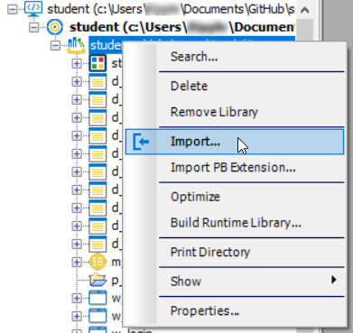

### 一、模块导入方法



### 二、目录文件列表

```
.
|-- d_c.srd                                  课程表
|-- d_s.srd                                  学生表
|-- d_score_dis.srd                          成绩分布
|-- d_score_input.srd                        成绩输入(带参数cnum)
|-- d_select_student.srd                     学生详细情况(带参数snum)
|-- d_select_student_course.srd              学生选课情况(带参数snum)
|-- d_select_student_score.srd               学生已修课程(带参数snum)
|-- d_student_score_report.srd               学生成绩报告单
|-- d_t.srd                                  教师表
|-- d_t_select.srd                           教师列表
|-- m_student.srm                            主菜单
|-- student.sra                              Generated Application Object
|-- w_course_create.srw                      "课程信息维护" 窗口
|-- w_course_score_dis.srw                   "课程成绩分布" 窗口
|-- w_login.srw                              "系统登录" 窗口
|-- w_manage.srw                             "管理员维护" 窗口
|-- w_select_course.srw                      "学生选课管理" 窗口
|-- w_select_student_score_report.srw        "学生成绩单" 窗口
|-- w_student_create.srw                     "学生信息维护" 窗口
|-- w_teacher_create.srw                     "教师信息维护" 窗口
`-- w_teacher_manage.srw                     "成绩管理" 窗口

0 directories, 21 files
```


